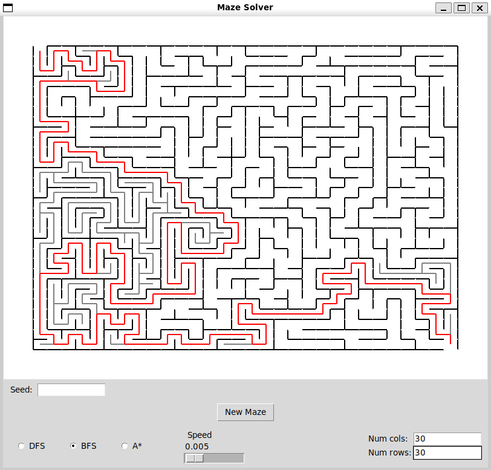
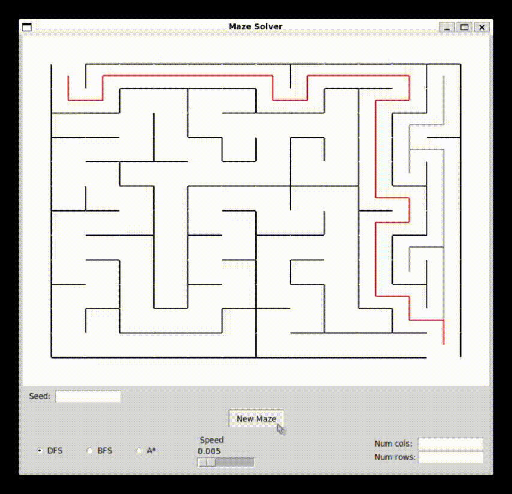

# maze_solver

maze_solver generates and solves mazes using multiple pathfinding algorithms.

It offers several customization options, including animation speed, maze size,
random seeds, and solver selection.
A breakdown of everything is provided further down.

## Screenshot

<p align="center">
    
</p>

## Table of Contents

- [Features](#features)
- [Demo](#demo)
- [Customizations](#customizations)
- [Project Structure](#project-structure)
- [Requirements](#requirements)
- [Installation](#installation)
- [How to Run](#how-to-run)
- [Running Tests](#running-tests)

## Features

- Random maze generation
- Seed-based reproducible mazes
- Adjustable maze dimensions
- Adjustable animation speed
- Multiple solving algorithms:
  - DFS
  - BFS
  - A*
- Interactive GUI built with Tkinter

## Demo

<p align="center">
  
</p>

## Customizations

In the window there are multiple boxes:

There is a 'New Maze' button that, when clicked,
creates a new maze with the given constraints.

There is a 'Seed' box that allows the user to enter a seed value.
The seed can be anything from "1234" to "hello123".
Using the same seed will generate the same maze every time.
If left blank, a random seed is used.

There are 'Num cols' and 'Num rows' boxes,
which set the number of columns and rows, respectively.
(The default is 12 by 12)

There is a speed up slider that makes the animation of the program solving the maze
either speed up or slow down.
And the max is 0.2 seconds per tick, and the minimum is 0.000 seconds.

Lastly, there are algorithm selection buttons labeled "DFS", "BFS" and "A*".
The selected algorithm will be used to solve the maze.

### Algorithms

- DFS (Depth-First Search): explores one path as far as possible before backtracking.
- BFS (Breadth-First Search): explores all neighboring cells level-by-level
    and guarantees the shortest path.
- A*: uses a heuristic to efficiently find the shortest path
    while exploring fewer nodes than BFS.

## Project Structure

```text
maze_solver/
├── images/
│   ├── demo.gif
│   └── screenshot.png
├── .markdownlint.json
├── cell.py
├── graphics.py
├── main.py
├── maze.py
├── README.md
└── test.py
```

## Requirements

- Python 3.10+
- Tkinter

Verify your installation:

```bash
python3 --version
python3 -m tkinter
```

## Installation

1. **Clone the repository**

```bash
   git clone https://github.com/yourusername/maze_solver.git
   cd maze_solver
```

### Troubleshooting

Run the following command in your terminal to see if it's installed:

```bash
python3 -m tkinter
```

You should see a little window pop up with some buttons inside.
If you do, you're done. Otherwise, continue.

If you're seeing an error like this:

```bash
ModuleNotFoundError: No module named '_tkinter'
```

You're missing the dependency. You should be on Python 3.10 or higher.
If you're not, update your Python version and try

```bash
python3 -m tkinter
```

again.

If that's still not working, it's important to understand that tkinter
depends on the Tcl/Tk library.
Installing the tk-dev or python-tk packages are usually the easiest way to
install and link it to your Python version. On Ubuntu (Linux), run:

```bash
sudo apt-get install python3-tk
```

On macOS, make sure you have Homebrew installed, and then run:

```bash
brew install python-tk
```

Your versions of python-tk and Python should match!

If

```bash
python3 -m tkinter
```

still isn't working; try uninstalling and reinstalling Python
so that it links to the now-available Tcl/Tk library.

## How to run

In order to run the program, run this command in the root folder,
which should be */maze_solver:

```bash
python3 main.py
```

This opens a window where a maze is generated and then solved.

## Running Tests

To ensure the maze logic is functioning correctly,
you can run the built-in unit tests.

From the root directory, run:

```bash
python3 tests.py
```
